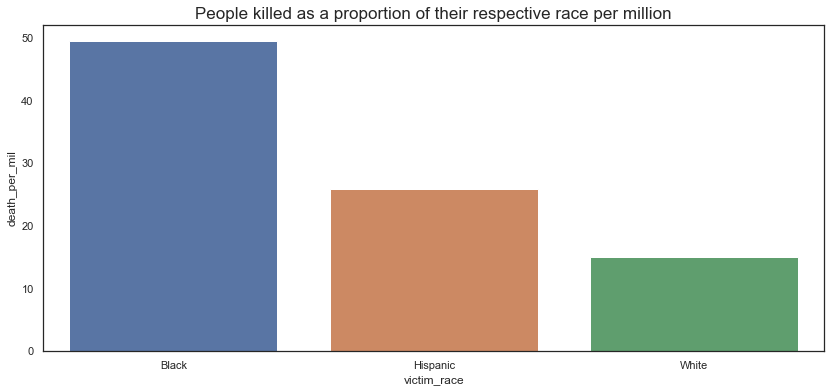

Data Visualization exercise based on the people killed in police shootings between 2013 and 2019


```python
import pandas as pd
import numpy as np
import seaborn as sns 
import os
from sklearn import linear_model, metrics
import matplotlib
import matplotlib.pyplot as plt
from collections import Counter
```


```python
os.chdir('/Users/shikharsharma/Downloads/Python_Projects/Datasets/US_shootings_data')
```


```python
#Getting police killings data from https://mappingpoliceviolence.org/
mpv_police_dataset = pd.read_excel('MPVDatasetDownload.xlsx')
```


```python
#creating a master sheet and going column by column to visualize the data and see if it needs to be cleaned
master_sheet = mpv_police_dataset[['victim_name', 'victim_age', 'victim_gender', 'victim_race',
       'date_of_incident', 'incident_address', 'city','state', 'zip', 'county', 'death_agency', 'cause_of_death',
       'brief_description', 'official_disposition', 'criminal_charge','news_link', 'mental_illness', 'unarmed', 'alleged_weapon',
       'alleged_threat_level', 'fleeing', 'body_cam', 'wapo_id','off_duty_killing', 'geography', 'id']]
master_sheet.columns
```


    Index(['victim_name', 'victim_age', 'victim_gender', 'victim_race',
           'date_of_incident', 'incident_address', 'city', 'state', 'zip',
           'county', 'death_agency', 'cause_of_death', 'brief_description',
           'official_disposition', 'criminal_charge', 'news_link',
           'mental_illness', 'unarmed', 'alleged_weapon', 'alleged_threat_level',
           'fleeing', 'body_cam', 'wapo_id', 'off_duty_killing', 'geography',
           'id'],
          dtype='object')


```python
#looking at the most common names of people killed. 
separate = master_sheet.victim_name[master_sheet.victim_name != 'Name withheld by police'].str.split()
a,b = zip(*separate)      #a=name b=surname             
name_list = a+b                         
name_count = Counter(name_list)         
most_common_names = name_count.most_common(15)  
x,y = zip(*most_common_names)
x,y = list(x),list(y)
# 
plt.figure(figsize=(15,10))
ax= sns.barplot(x=x, y=y,palette = sns.cubehelix_palette(len(x)))
plt.xlabel('Name / Surname of killed people')
plt.ylabel('Frequency')
plt.title('Top 15 Name or Surname of killed people')
```


    Text(0.5, 1.0, 'Top 15 Name or Surname of killed people')


```python
#Looking with victim_race - visualizing distribution based on race & seeing if the data needs to be cleaned up. 
master_sheet['victim_race'].value_counts()
```


    White               3378
    Black               1944
    Hispanic            1335
    Unknown race         670
    Asian                118
    Native American      112
    Unknown Race          64
    Pacific Islander      42
    Name: victim_race, dtype: int64


```python
#cleaning up the unknown race data
master_sheet.loc[master_sheet.victim_race == 'Unknown Race', 'victim_race'] = "Unknown"
master_sheet.loc[master_sheet.victim_race == 'Unknown race', 'victim_race'] = "Unknown"
master_sheet.loc[master_sheet.victim_race == 'Pacific Islander', 'victim_race'] = "Unknown"
master_sheet['victim_race'].value_counts()
```

    /Users/shikharsharma/opt/anaconda3/lib/python3.7/site-packages/pandas/core/indexing.py:965: SettingWithCopyWarning: 
    A value is trying to be set on a copy of a slice from a DataFrame.
    Try using .loc[row_indexer,col_indexer] = value instead
    
    See the caveats in the documentation: https://pandas.pydata.org/pandas-docs/stable/user_guide/indexing.html#returning-a-view-versus-a-copy
      self.obj[item] = s


    White              3378
    Black              1944
    Hispanic           1335
    Unknown             776
    Asian               118
    Native American     112
    Name: victim_race, dtype: int64


```python
#Cleaning up the victim age data
master_sheet = master_sheet.loc[(master_sheet.victim_age != 'Unknown') & (master_sheet.victim_age != '40s')] 
master_sheet['victim_age'] = master_sheet['victim_age'].astype(float)
master_sheet.victim_age.fillna(value=master_sheet.victim_age.mean(), inplace=True) # Dealing with missing AGE values. Set them to mean of all ages. 
master_sheet.victim_age = master_sheet.victim_age.astype(int)
```


```python
#looking at the incident date and dividing it into year, month and month-year combo
master_sheet['date_of_incident'] = pd.to_datetime(master_sheet['date_of_incident'])
master_sheet['incident_year'] = master_sheet['date_of_incident'].dt.year
master_sheet['incident_month'] = master_sheet['date_of_incident'].dt.month
master_sheet['incident_month_year'] = master_sheet['date_of_incident'].dt.to_period('M')

```


```python
#adding the total population by race for US: from https://en.wikipedia.org/wiki/Demography_of_the_United_States
conditions = [master_sheet["victim_race"]=="Asian", master_sheet["victim_race"]=="White", 
              master_sheet["victim_race"]=="Hispanic", master_sheet["victim_race"]=="Black",
              master_sheet["victim_race"]=="Native American", master_sheet["victim_race"]=="Unknown"]
numbers = [14674252, 223553265, 50477594, 38929319, 2932248, 22579629]
master_sheet["total_population"] = np.select(conditions, numbers, default="zero").astype(int)

```


```python
#As the number of Asians and Native Americans seems very low, 
#we will take them out for the sake of continuing with our analysis as there could be multiple anomalies there. 
#visualizing people killed based on race by only looking at killings where race is known to be a prevalant factor
master_sheet_race = master_sheet.loc[master_sheet.victim_race != 'Unknown'] 
master_sheet_race = master_sheet_race.loc[master_sheet.victim_race != 'Asian'] 
master_sheet_race = master_sheet_race.loc[master_sheet.victim_race != 'Native American'] 

#Also adding columns to count death per million and count
master_sheet_race['victim_count'] = 1
master_sheet_race['death_per_mil'] = master_sheet_race['victim_count'] * 1.0 /master_sheet_race['total_population'] * 1000000

#Plotting total number of people killed by race
plt.figure(figsize=(15,5))
sns.countplot(data=master_sheet_race, x="victim_race")

plt.title("Total number of people killed, by race", fontsize=17)
```


    Text(0.5, 1.0, 'Total number of people killed, by race')


```python
race_based_counts = pd.DataFrame(master_sheet_race[['victim_race', 'victim_count', 'total_population', 'death_per_mil']]
                    .groupby(['victim_race', 'total_population']).sum().reset_index())
#looking at the data
print(race_based_counts)
```

      victim_race  total_population  victim_count  death_per_mil
    0       Black          38929319          1928      49.525654
    1    Hispanic          50477594          1307      25.892676
    2       White         223553265          3359      15.025502


```python
#Visualizing people killed per million people based on race
plt.figure(figsize=(14,6))
plt.title("People killed as a proportion of their respective race per million", fontsize=17)
sns.barplot(x=race_based_counts.victim_race, y=race_based_counts.death_per_mil)
```


    <matplotlib.axes._subplots.AxesSubplot at 0x7fd44a6091d0>


```python
#plotting the number of people killed over time by race
plt.figure(figsize=(14,6))
(master_sheet_race
 .groupby(['incident_year', 'victim_race'])
 .size()
 .unstack()
 .plot.bar()
)
plt.title("People killed in police shootings: By race over time(2013-2019)", fontsize=17)
plt.show
```


    <function matplotlib.pyplot.show(*args, **kw)>


    <Figure size 1008x432 with 0 Axes>


```python
#creating time specific instances to visualize race based killings by time
race_killings_per_mil = pd.DataFrame(master_sheet_race[['incident_month_year','incident_year','victim_race', 'victim_count', 'death_per_mil']]
                        .groupby(['incident_month_year','incident_year', 'victim_race']).sum().reset_index())
```


```python
#Plotting the number of people per million who get killed per year
plt.figure(figsize=(20,10))
(race_killings_per_mil[['incident_year', 'victim_race', 'death_per_mil']]
 .groupby(['incident_year', 'victim_race'])
 .sum()
 .unstack()
 .plot.bar()
)
plt.title("People killed in police shootings per 1M people per year: by race over time", fontsize=17)
plt.show
```


    <function matplotlib.pyplot.show(*args, **kw)>


    <Figure size 1440x720 with 0 Axes>


```python
#checking if any seasonality exists in the data by plotting the number of people killed per month

#plotting the killings per month over time
plt.figure(figsize=(500,300))
(master_sheet_race
 .groupby(['incident_month_year', 'victim_race'])
 .size()
 .unstack()
 .plot.line()
)
plt.title("People killed in police shootings per month: by race over time", fontsize=17)
plt.show
```


    <function matplotlib.pyplot.show(*args, **kw)>


    <Figure size 36000x21600 with 0 Axes>


```python
#plotting the killings per 1M population per month over time
plt.figure(figsize=(500,300))
(race_killings_per_mil[['incident_month_year', 'victim_race', 'death_per_mil']]
 .groupby(['incident_month_year', 'victim_race'])
 .sum()
 .unstack()
 .plot.line()
)
plt.title("Killings per 1M people per month: by race over time", fontsize=17)
plt.show
```


    <function matplotlib.pyplot.show(*args, **kw)>


    <Figure size 36000x21600 with 0 Axes>


```python
#try to establish seasonality here. 
#see if you can come up with predictions of death per race per month 
#see if this can be combined with state level info
```


```python
#Looking at the victim age now
#visualizing the age of all people killed in our dataset
plt.figure(figsize=(15,7))
age_dist = sns.distplot(master_sheet_race['victim_age'], bins=40)
age_dist.set(xlabel="Age", ylabel="Count")
plt.title("People killed in police shootings: Age distribution", fontsize=17)
```


    Text(0.5, 1.0, 'People killed in police shootings: Age distribution')


```python
#based on the count of people killed by age, we come up with custom bins to analyze the victim age data further
bins = [0, 10, 15, 20, 25, 30, 35, 40, 45, 50, 55, 60, np.inf]
names = ['0-10', '10-15', '15-20', '20-25', '25-30', '30-35', '35-40', '40-45', '45-50', '50-55', '55-60', '60+']
master_sheet_race['victim_age_range'] = pd.cut(master_sheet_race['victim_age'], bins, labels=names)
```


```python
#visualizing the age of all people killed based on race
plt.figure(figsize=(14,6))
(master_sheet_race
 .groupby(['victim_age_range', 'victim_race'])
 .size()
 .unstack()
 .plot.bar()
)
plt.title("People killed in police shootings: by race over age", fontsize=17)
plt.show

```


    <function matplotlib.pyplot.show(*args, **kw)>


    <Figure size 1008x432 with 0 Axes>


```python
#creating time specific instances to visualize race based killings by time
race_killings_per_mil = pd.DataFrame(master_sheet_race[['victim_age_range','incident_year','victim_race', 'victim_count', 'death_per_mil']]
                        .groupby(['victim_age_range','incident_year', 'victim_race']).sum().reset_index())
```


```python
#Plotting the number of people per million who get killed per age group
plt.figure(figsize=(14,6))
(race_killings_per_mil[['victim_age_range', 'victim_race', 'death_per_mil']]
 .groupby(['victim_age_range', 'victim_race'])
 .sum()
 .unstack()
 .plot.bar()
)
plt.title("Killings per 1M people per year: by race over age groups", fontsize=17)
plt.show
```


    <function matplotlib.pyplot.show(*args, **kw)>


    <Figure size 1008x432 with 0 Axes>


```python
#Looking at the location based data now
plt.figure(figsize=(14,10))
sns.countplot(data=master_sheet_race, x=master_sheet_race.state)
plt.title("Number of police killings, by state", fontsize=30)
```


    Text(0.5, 1.0, 'Number of police killings, by state')


```python
#looking at city based data and identifying the deadliest cities 
deadly_city_info = pd.DataFrame(master_sheet_race[['city','state', 'victim_race', 'victim_count', 'death_per_mil']]
                        .groupby(['city','state', 'victim_race']).sum().reset_index())

deadly_city_info['city_victim_counts'] = deadly_city_info.groupby(['city','state'])['victim_count'].transform('sum')

deadly_city_info = deadly_city_info.loc[deadly_city_info['city_victim_counts'] > 25]
```


```python
#Plotting the number of people per million who get killed per age group
plt.figure(figsize=(14,6))
(deadly_city_info[['city', 'city_victim_counts']]
 .groupby(['city'])
 .first()
 .unstack()
 .plot.bar()
)
plt.title("Killings per year: by city", fontsize=17)
plt.show
```


    <function matplotlib.pyplot.show(*args, **kw)>


```python
#See if we can get the race based census data at city level
```


```python
deadly_city_info2 = deadly_city_info.loc[deadly_city_info['city_victim_counts'] > 25]
#Plotting the number of people per million who get killed per age group
plt.figure(figsize=(14,6))
(deadly_city_info2[['city', 'victim_race', 'victim_count']]
 .groupby(['city', 'victim_race'])
 .first()
 .unstack()
 .plot.bar()
)
plt.title("Killings per year: by race over city groups", fontsize=17)
plt.show

```


    <function matplotlib.pyplot.show(*args, **kw)>


    <Figure size 1008x432 with 0 Axes>


```python
#See if we can get the race based census data at city level and 
#integrate with this data to see proportion of race being killed
#Also see if we can link the general crime rate 
```


```python
#Looking at the police department responsible for deaths and seeing if any police department stands out
#looking at PD based data and identifying the deadliest PDs 
deadly_police_depts = pd.DataFrame(master_sheet_race[['death_agency','victim_race', 'victim_count']]
                        .groupby(['death_agency', 'victim_race']).sum().reset_index())

deadly_police_depts['pd_victim_counts'] = deadly_police_depts.groupby(['death_agency'])['victim_count'].transform('sum')

deadly_police_depts = deadly_police_depts.loc[deadly_police_depts['pd_victim_counts'] > 30]
```


```python
#Plotting the number of people per race who get killed based on police department
plt.figure(figsize=(14,6))
(deadly_police_depts[['death_agency', 'victim_race', 'victim_count']]
 .groupby(['death_agency', 'victim_race'])
 .first()
 .unstack()
 .plot.bar()
)
plt.title("Killings per 1M people per year: by race over police department", fontsize=17)
plt.show
```


    <function matplotlib.pyplot.show(*args, **kw)>


    <Figure size 1008x432 with 0 Axes>


```python
#Looking at the cause of death data now
cause_death = master_sheet_race['cause_of_death'].value_counts()
#plotting the most common ways of people getting killed
plt.figure(figsize=(14,10))
sns.barplot(x=cause_death[:7].index,y=cause_death[:7].values)
plt.ylabel('Number of deaths')
plt.xlabel('Cause of deaths')
plt.title("Number of police killings, by cause of death", fontsize=30)
```


    Text(0.5, 1.0, 'Number of police killings, by cause of death')


```python
##Cleaning up alleged weapon data plotting distribution of alleged weapon amongst the victims
master_sheet_race.alleged_weapon = master_sheet_race.alleged_weapon.str.strip()
master_sheet_race.loc[master_sheet_race.alleged_weapon == 'unknown weapon', 'alleged_weapon'] = "unknown"
master_sheet_race.loc[master_sheet_race.alleged_weapon == 'unclear', 'alleged_weapon'] = "unknown"
master_sheet_race.loc[master_sheet_race.alleged_weapon == 'undetermined', 'alleged_weapon'] = "unknown"
master_sheet_race.loc[master_sheet_race.alleged_weapon == 'toy weapon', 'alleged_weapon'] = "toy"
weapon = pd.DataFrame(master_sheet_race['alleged_weapon'].value_counts().reset_index())
weapon.columns = ['alleged_weapon', 'victim_count']
```


```python
#plotting the most common ways of people getting killed
plt.figure(figsize=(14,10))
sns.barplot(x=weapon[:7].alleged_weapon,y=weapon[:7].victim_count)
plt.ylabel('Number of deaths')
plt.xlabel('Alleged Weapon')
plt.title("Number of police killings, by alleged weapon", fontsize=30)
```


    Text(0.5, 1.0, 'Number of police killings, by alleged weapon')





```python
#Looking at the dealiest alleged weapons and visualizing distribution based on race
deadly_alleged_weapons=weapon[:7]
temp_master = master_sheet_race.merge(deadly_alleged_weapons['alleged_weapon'], on = 'alleged_weapon', how = 'inner')

#plotting the number of deaths per million based on the alleged weapon
plt.figure(figsize=(14,6))
(temp_master[['alleged_weapon', 'victim_race', 'victim_count']]
 .groupby(['alleged_weapon', 'victim_race'])
 .sum()
 .unstack()
 .plot.bar()
)
plt.title("Killings per year: by race over alleged weapons", fontsize=17)
plt.show
```


    <function matplotlib.pyplot.show(*args, **kw)>


    <Figure size 1008x432 with 0 Axes>


```python
#plotting the number of deaths per million based on the alleged weapon
plt.figure(figsize=(14,6))
(temp_master[['alleged_weapon', 'victim_race', 'death_per_mil']]
 .groupby(['alleged_weapon', 'victim_race'])
 .sum()
 .unstack()
 .plot.bar()
)
plt.title("Killings per 1M people per year: by race over alleged weapons", fontsize=17)
plt.show
```


    <function matplotlib.pyplot.show(*args, **kw)>


    <Figure size 1008x432 with 0 Axes>


```python
#looking at mental illness data to see if there is any distinction based on race
#cleaning up mental illness data first 
master_sheet_race['mental_illness'] = master_sheet_race['mental_illness'].str.strip()
master_sheet_race.loc[master_sheet_race.mental_illness == 'Unkown', 'mental_illness'] = "Unknown"
master_sheet_race.loc[master_sheet_race.mental_illness == 'unknown', 'mental_illness'] = "Unknown"
#plotting the number of deaths based on mental illness
plt.figure(figsize=(14,6))
(master_sheet_race[['mental_illness', 'victim_race', 'victim_count']]
 .groupby(['mental_illness', 'victim_race'])
 .sum()
 .unstack()
 .plot.bar()
)
plt.title("Killings per year: by race over mental illness", fontsize=17)
plt.show
```


    <function matplotlib.pyplot.show(*args, **kw)>


    <Figure size 1008x432 with 0 Axes>


```python
#looking at mental illness data to see if there is any distinction based on race
#cleaning up mental illness data first 
master_sheet_race['mental_illness'] = master_sheet_race['mental_illness'].str.strip()
master_sheet_race.loc[master_sheet_race.mental_illness == 'Unkown', 'mental_illness'] = "Unknown"
master_sheet_race.loc[master_sheet_race.mental_illness == 'unknown', 'mental_illness'] = "Unknown"
#plotting the number of deaths based on mental illness
plt.figure(figsize=(14,6))
(master_sheet_race[['mental_illness', 'victim_race', 'death_per_mil']]
 .groupby(['mental_illness', 'victim_race'])
 .sum()
 .unstack()
 .plot.bar()
)
plt.title("Killings per year: by race over mental illness", fontsize=17)
plt.show
```


    <function matplotlib.pyplot.show(*args, **kw)>


    <Figure size 1008x432 with 0 Axes>


```python
master_sheet_race['body_cam'] = master_sheet_race['body_cam'].str.strip()
master_sheet_race.loc[master_sheet_race.body_cam == 'no', 'body_cam'] = "No"
master_sheet_race.loc[master_sheet_race.body_cam == 'Surveillance Video', 'body_cam'] = "Yes"
master_sheet_race.loc[master_sheet_race.body_cam == 'Bystander Video', 'body_cam'] = "Yes"
master_sheet_race[['geography','victim_race','victim_count']].groupby(['geography','victim_race']).count().unstack()
```


<div>
<style scoped>
    .dataframe tbody tr th:only-of-type {
        vertical-align: middle;
    }

    .dataframe tbody tr th {
        vertical-align: top;
    }

    .dataframe thead tr th {
        text-align: left;
    }

    .dataframe thead tr:last-of-type th {
        text-align: right;
    }
</style>
<table border="1" class="dataframe">
  <thead>
    <tr>
      <th></th>
      <th colspan="3" halign="left">victim_count</th>
    </tr>
    <tr>
      <th>victim_race</th>
      <th>Black</th>
      <th>Hispanic</th>
      <th>White</th>
    </tr>
    <tr>
      <th>geography</th>
      <th></th>
      <th></th>
      <th></th>
    </tr>
  </thead>
  <tbody>
    <tr>
      <th>Rural</th>
      <td>194</td>
      <td>155</td>
      <td>1078</td>
    </tr>
    <tr>
      <th>Suburban</th>
      <td>879</td>
      <td>692</td>
      <td>1714</td>
    </tr>
    <tr>
      <th>Urban</th>
      <td>838</td>
      <td>455</td>
      <td>540</td>
    </tr>
  </tbody>
</table>
</div>


